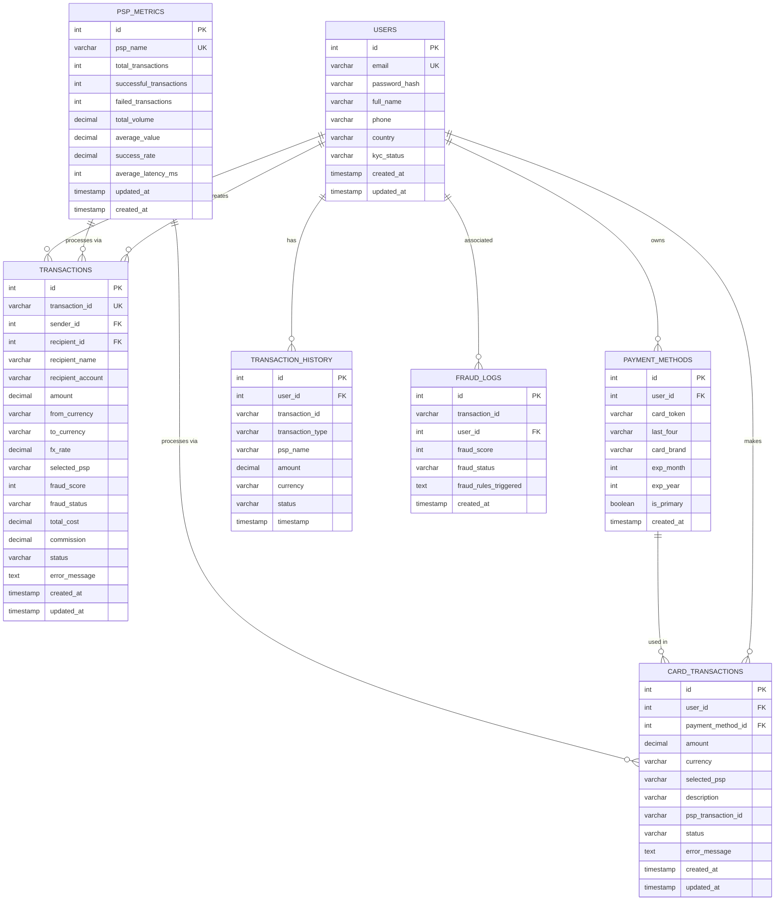

# PerfectPay - Entity Relationship Diagram

## Mermaid ER Diagram



## Visual Representation

### Core Entities

#### 1. USERS (Merkez Tablo)
- Tüm işlemlerin merkezinde
- Payment methods, transactions, card transactions ile ilişkili
- KYC durumu ve kullanıcı bilgileri

#### 2. PAYMENT_METHODS
- Kullanıcıların kayıtlı kartları
- Card transactions'da kullanılır
- Birincil kart seçimi (is_primary)

#### 3. TRANSACTIONS (P2P Transfers)
- Sender ve recipient ilişkisi (self-referencing)
- PSP seçimi ve komisyon hesaplaması
- Fraud detection entegrasyonu

#### 4. CARD_TRANSACTIONS
- Kart ile yapılan ödemeler
- Payment method ve PSP bilgisi
- Transaction history'ye kaydedilir

#### 5. TRANSACTION_HISTORY
- Tüm işlemlerin audit log'u
- Kullanıcı bazlı geçmiş
- Analytics için kullanılır

#### 6. PSP_METRICS
- PSP performans metrikleri
- Success rate, latency tracking
- Optimal routing için kullanılır

#### 7. FRAUD_LOGS
- Fraud detection kayıtları
- Risk skorları ve tetiklenen kurallar
- Security audit için kullanılır

## Relationships Summary

| From | To | Type | Description |
|------|-----|------|-------------|
| USERS | TRANSACTIONS | 1:N | User sends money (sender_id) |
| USERS | TRANSACTIONS | 1:N | User receives money (recipient_id) |
| USERS | PAYMENT_METHODS | 1:N | User owns cards |
| USERS | CARD_TRANSACTIONS | 1:N | User makes card payments |
| USERS | TRANSACTION_HISTORY | 1:N | User's transaction history |
| USERS | FRAUD_LOGS | 1:N | User's fraud checks |
| PAYMENT_METHODS | CARD_TRANSACTIONS | 1:N | Card used in transactions |
| PSP_METRICS | Multiple | 1:N | PSP processes transactions |

## Indexes

### Performance Indexes
- `idx_users_email` - Fast user lookup
- `idx_users_created_at` - User analytics
- `idx_payment_methods_user_id` - User's cards
- `idx_transactions_sender_id` - Sender's transactions
- `idx_transactions_recipient_id` - Recipient's transactions
- `idx_transactions_transaction_id` - Transaction lookup
- `idx_transactions_created_at` - Time-based queries
- `idx_transactions_status` - Status filtering
- `idx_transactions_psp` - PSP analytics
- `idx_card_transactions_user_id` - User's card payments
- `idx_card_transactions_status` - Payment status
- `idx_card_transactions_created_at` - Time-based queries
- `idx_transaction_history_user_id` - User history
- `idx_transaction_history_timestamp` - Time-based audit
- `idx_transaction_history_type` - Transaction type filtering
- `idx_psp_metrics_psp_name` - PSP lookup
- `idx_fraud_logs_user_id` - User fraud history
- `idx_fraud_logs_created_at` - Time-based fraud analysis

## Data Flow

```
User Registration → USERS table
    ↓
Add Payment Method → PAYMENT_METHODS table
    ↓
Initiate Transaction → Fraud Check (FRAUD_LOGS)
    ↓
Select Optimal PSP → Check PSP_METRICS
    ↓
Process Payment → TRANSACTIONS or CARD_TRANSACTIONS
    ↓
Record History → TRANSACTION_HISTORY
    ↓
Update Metrics → PSP_METRICS
```

## Notes

- **Foreign Keys**: ON DELETE CASCADE for user-dependent tables
- **Unique Constraints**: email (users), transaction_id (transactions), psp_name (psp_metrics)
- **Timestamps**: All tables have created_at, some have updated_at
- **Decimal Precision**: (15,2) for amounts, (20,10) for FX rates, (5,2) for percentages
